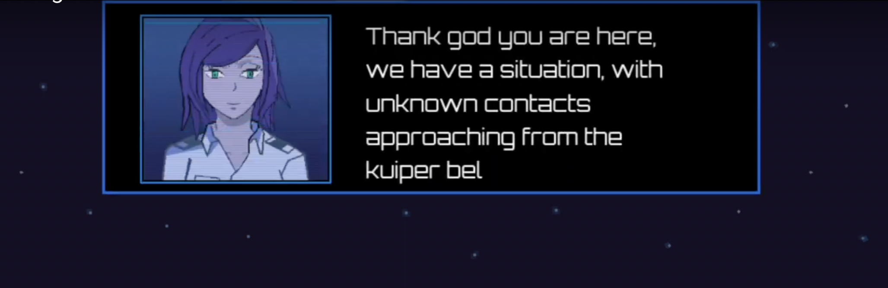
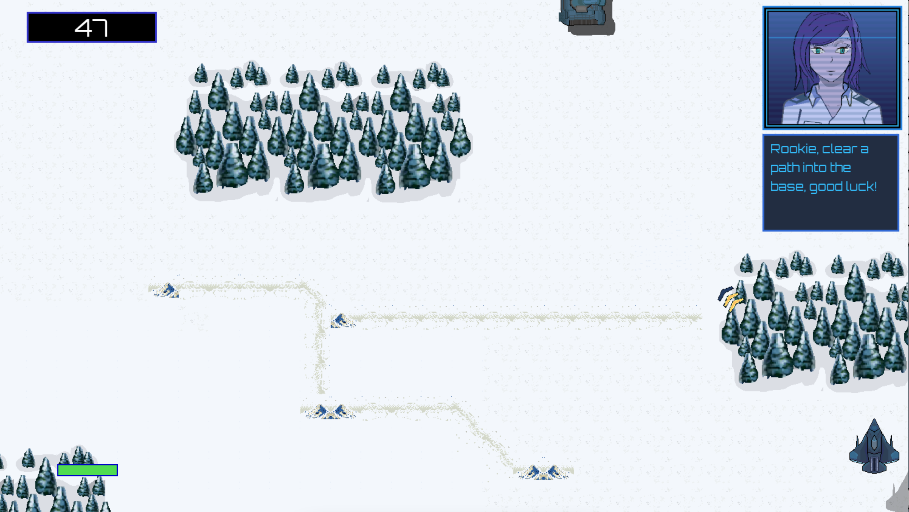

# Modified CutScene Manager for APCSP

Based on Cut-Scene-Manager by [@murchie85](https://github.com/murchie85), this implementation is a simplification to provide my APCSP students a chance to utilize a third-party API and extend their simple games with an interesting cutscene library.

Our APCSP cohort builds projects that are simple affairs.  New programmers getting used to the edit/test/debug cycle of building applications aren't (yet) using classes instead of global variables for game design.  I intend to create a wrapper class to hide much of the underlying code to allow my students to employ cutscenes without having to heavily modify their code.  See simple code used in my class in [/samples](./samples/) for reference.  Note these skeleton files will not satisfy the requirements for the APCSP Create Task (no methods with parameters).

[@murchie85](https://github.com/murchie85) was kind enough to get things started after I emailed him for the supporting files.  Any mistakes or poor programming encountered are mine; anything cool is definitely his.

---

## Current Status - Non-working
- 2/21/23 figuring out variables and code path
- 2/20/23 switched to VSCode to ease editing
- 2/19/23 collecting needed files
- 2/18/23 project started

---

## Work Yet To-Do
Moved to separate [TODO](TODO.md) file.

---
## About my APCSP course

If you have any questions about our course, contact me at slater.mccue at g m ail.  
_I will update this info when I have begun building a reference site._

---

## Original description from @murchie85

This code implements a cutScene class in the game engine, using Pygame. The cutScene class is used for displaying different types of in-game notifications, such as incoming alerts and reinforcement notifications. The class contains attributes and methods that are used for managing the display of the notifications on the screen. The different attributes store information such as the position and size of the notification window, the themes and colors used to display the notifications, the animations and sounds played when the notifications appear, and the text displayed in the notifications. The runCutScene method is used to open the dialogue window and display the notifications.

## Example use by @murchie85 - Steel Spirit 

A free-roam scroller hybrid shooter. The objects and functions I was originally missing - gui, game, scrollingDialogue and scrollingDialogueSimple, were appropriated from this project.  Check it out at [https://github.com/murchie85/steelSpirit](https://github.com/murchie85/steelSpirit).

